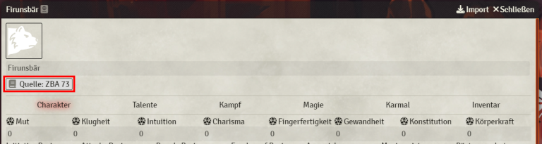
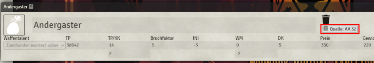

# Foundry VTT DSA 4.1 Compendiums

Diverse Kompendien für das Foundry VTT System **DSA 4.1**  
https://gitlab.com/foundry-vtt-dsa/dsa-4.1-core/dsa-4.1-system

Kompatibel mit FoundryVTT v10!

## Hinweis zu Tieren und Kompendiumlinks
Das Tierkompendium enthält neben der potenziellen Beute keine Werte für die jeweiligen Tiere/Kreaturen. 
Es gibt jedoch die Möglichkeit Zoo-Botanica Aventurica als PDF Journal zu hinterlegen und aus dem jeweiligen "Character-Sheet" aufzurufen.
Gleiches gilt für die Waffen, Schilde, Rüstungen und sonstige Ausrüstungsgegenstände.  

## Installation

1. Im Foundry-Setup-Bildschirm auf dem Tab "Add-on Modules" auf "Install Module" klicken
2. Die folgende URL unten bei "Manifest URL" eingeben: `https://raw.githubusercontent.com/Unzumutbar/dsa-41-compendiums/main/module.json`
3. Foundry VTT und Welt starten und Modul `DSA 4.1 Kompendien` dort aktivieren

## Moduleinstellungen

- `Kompendium Links anzeigen`: Journal Links zu den jeweiligen Gegenständen, Waffen und Kreaturen können ein- oder ausgeblendet werden
  - Standard: `true`
- `Aventurisches Arsenal Journalname`: Namen des PDF Journals *Aventurisches Arsenal* 
  - Standard: `AA`
- `Aventurisches Arsenal PDF Offset`: Seitenoffset der PDF Datei
  - Standard: `1`
- `Aventurischer Almanach Journalname`: Namen des PDF Journals *Aventurischer Almanach* 
  - Standard: `AvAlm`
- `Aventurischer Almanach PDF Offset`: Seitenoffset der PDF Datei
  - Standard: `1`
- `Geographia Aventurica Journalname`: Namen des PDF Journals *Geographia Aventurica* 
  - Standard: `GA`
- `Geographia Aventurica PDF Offset`: Seitenoffset der PDF Datei
  - Standard: `1`
- `Handelsherr & Kiepenkerl Journalname`: Namen des PDF Journals *Handelsherr & Kiepenkerl* 
  - Standard: `H&K`
- `Handelsherr & Kiepenkerl PDF Offset`: Seitenoffset der PDF Datei
  - Standard: `1`
- `Stäbe, Ringe, Dschinnenlampen Journalname`: Namen des PDF Journals *Stäbe, Ringe, Dschinnenlampen* 
  - Standard: `SRD`
- `Stäbe, Ringe, Dschinnenlampen PDF Offset`: Seitenoffset der PDF Datei
  - Standard: `1`
- `Wege der Alchimie Journalname`: Namen des PDF Journals *Wege der Alchimie* 
  - Standard: `WdA`
- `Wege der Alchimie PDF Offset`: Seitenoffset der PDF Datei
  - Standard: `1`
- `Zoo-Botanica Aventurica`: Namen des PDF Journals *Zoo-Botanica Aventurica* 
  - Standard: `WdA`
- `Zoo-Botanica Aventurica PDF Offset`: Seitenoffset der PDF Datei
  - Standard: `1`

## Credits

https://github.com/Oromis hat die Kompatibilität für Version 10 hinzugefügt und die Installation vereinfacht.
Vielen Dank dafür.

## Icons

Icons provided under the Creative Commons 3.0 BY from `https://github.com/game-icons/icons`
Icons made by [Delapouite](https://delapouite.com/), [Lorc](https://lorcblog.blogspot.com/), [Carl Olsen](https://twitter.com/unstoppableCarl), [Skol](https://twitter.com/unstoppableCarl), 
